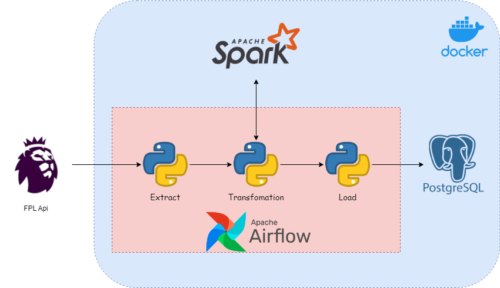
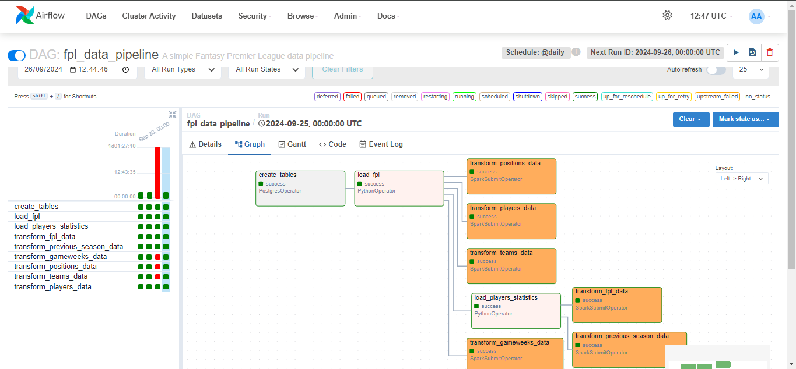
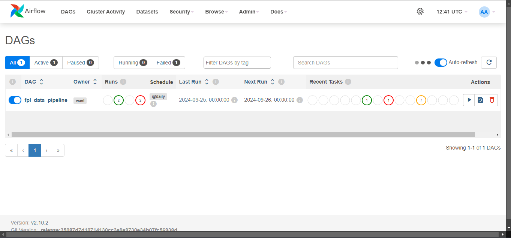

# ⚽ Fantasy Premier League Data Warehouse

> This project lays the foundation for a comprehensive data warehouse solution for Fantasy Premier League (FPL) data. Whether your goal is generating analytical reports or developing predictive models, this project is designed to support it.



### 🛠️ Technologies & Tools Used
**Apache Spark**, **Apache Airflow**, **PostgreSQL**, **Data Warehousing**, **Data Modeling**, **ETL**

## 📈 Project Stages
### 1. 🛠️ Environment Setup
Using **Docker** to create a reproducible environment for running Spark, Airflow, PostgreSQL, and PgAdmin.

### 2. 🗂️ Data Modeling
Designing the data warehouse schema in PostgreSQL to efficiently store and manage processed FPL data.


### 3. 🔄 ETL Pipeline
Building the ETL pipeline using **Apache Spark** and orchestrating it with **Airflow** to extract, transform, and load FPL data.




### 4. 🧩 Workflow Orchestration
* Utilizing **Airflow** to orchestrate and manage the data workflows.
* **Scheduler** ETL pipeline executions for each gameweek.



---


## 🚀 Future Work

This data warehouse opens the door for potential upgrades such as:
- **⚽ Match Data Analysis**: Analyze match statistics in depth.
- **📈 Team Performance Dashboard**: Build dashboards for users to view their team's stats and insights.
- **📊 Generate Reports**:Integrate with tools like Power BI or Metabase to create interactive visualizations.
- **🤖 Build Predictive Models**: Develop machine learning models to forecast player performance in upcoming gameweeks.

---

## 💻 Run the Project & Make Your Own Environment

You can set up your own environment by running:
```bash
git clone https://github.com/xRayzox/Fantasy-Premier-League.git
cd Fantasy-Premier-League
docker-compose up -d
```
---
## 🤝 Join Me
I’m eager to collaborate with FPL enthusiasts and data analysts. If you have suggestions or would like to contribute, feel free to open an issue or submit a pull request. Let’s build something awesome together!
